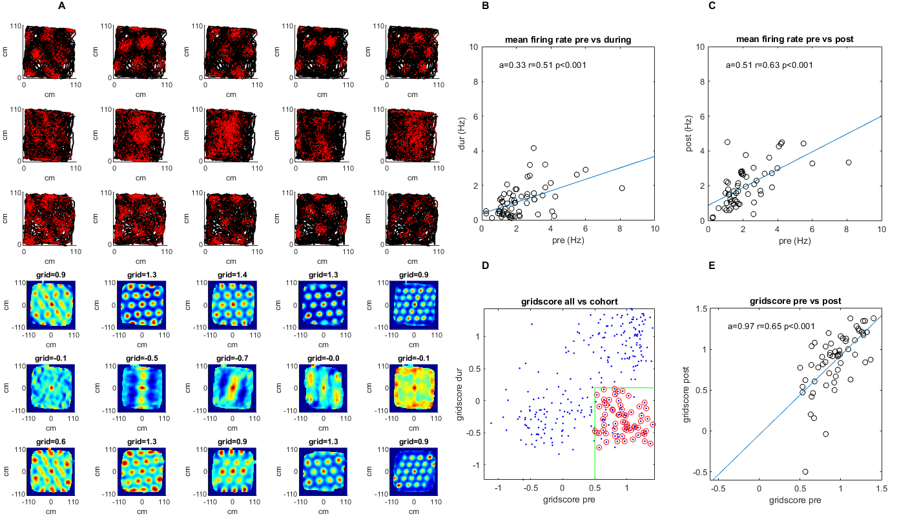
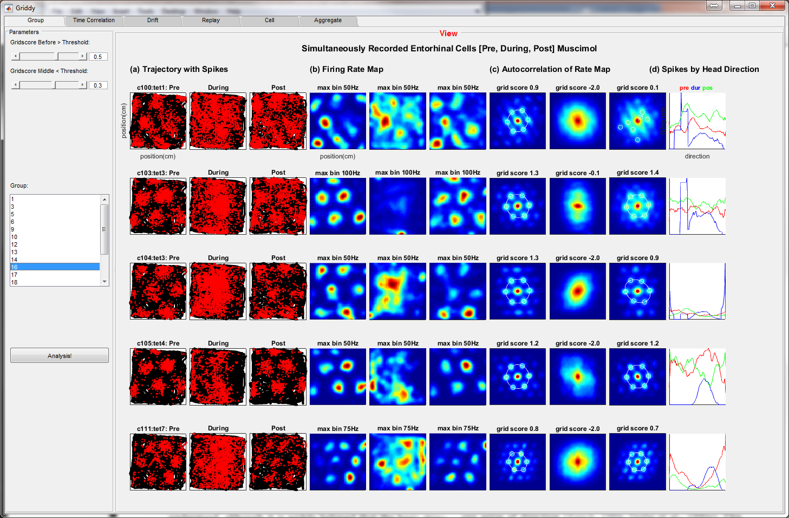
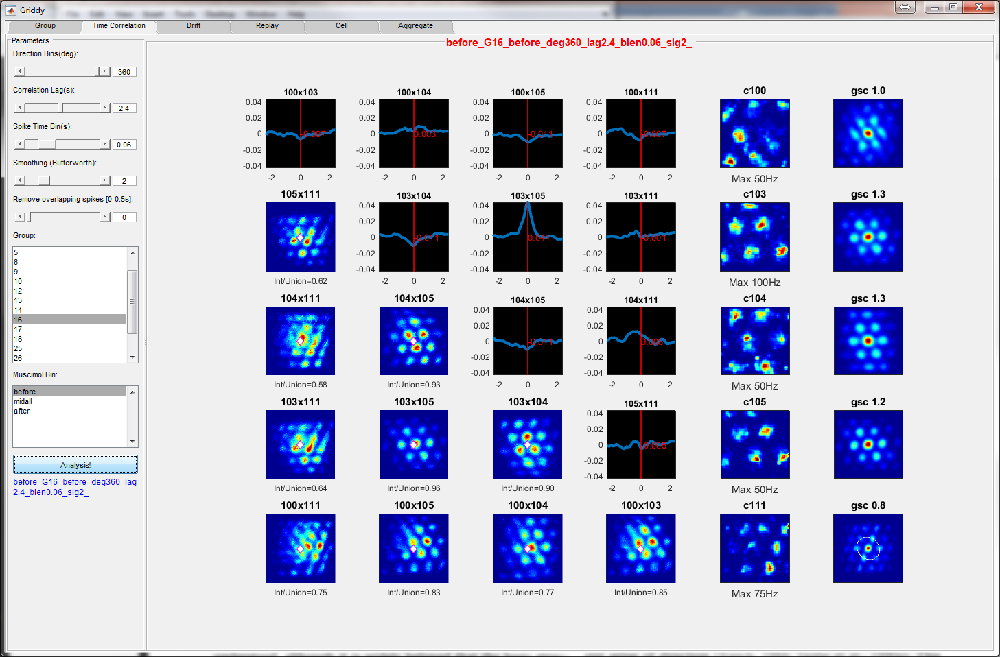
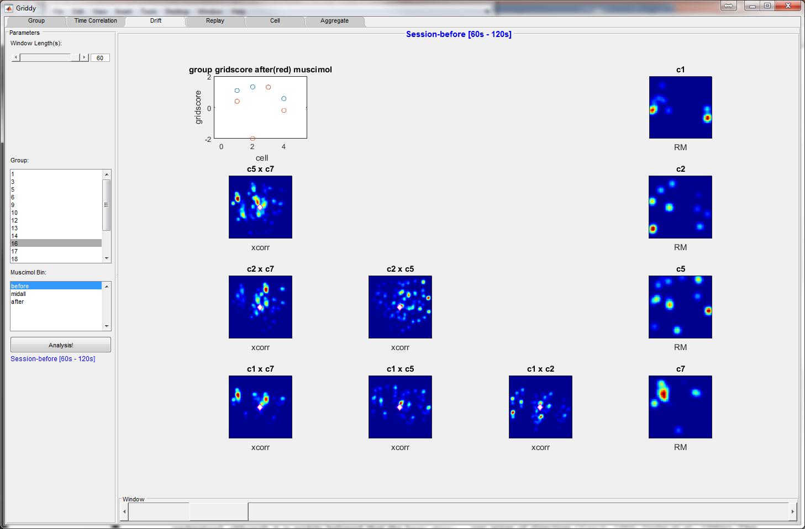
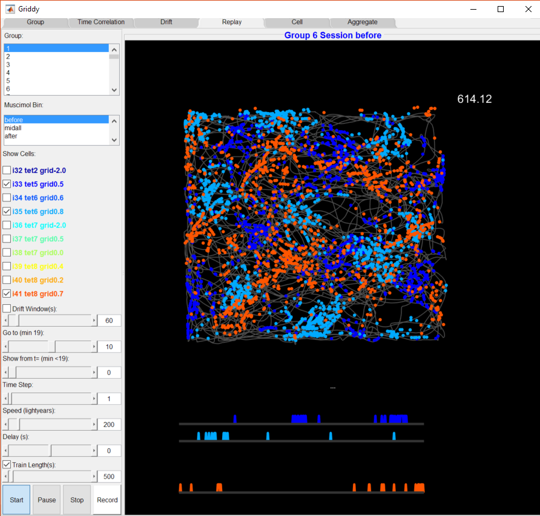

# Analysis of grid cell activity during hippocampal inactivation

This is the code used for the analysis presented in the paper ***During hippocampal inactivation, grid cells maintain their synchrony, even when the grid pattern is lost*** <https://elifesciences.org/articles/47147>. The data analyzed is from the study described in a previous paper, *Grid cells require excitatory drive from the hippocampus* <https://www.nature.com/articles/nn.3311>. Additionally there is code for viewing the data using a GUI (Pandora.m).

## Installation

This code was written and tested on MATLAB R2018.
Additional toolboxes maybe required depending on how code is used (in which case MATLAB will notify accordingly). The data necessary to generate the analysis is located on the Dryad database <https://datadryad.org/stash/dataset/doi:10.5061/dryad.bk3j9kd6d>.

## Usage

The figures for the paper were generated using the functions f1.m for figure 1, f2.m for fig 2 etc. The supplementary figures have a different naming convention in the code but can be found using a global file search (i.e. search 'f3s1' to find fig 3s1). It is necessary to have the experiment data in order to generate this analysis (see Installation). Although the input data is provided in the above mentioned database, further post processing was done, which was used as input to generate the figures. All the code to pre- and post-process the data is in this repository, and can be found using a global file search for the variable or field name needed.  

## GUI

If you are interested in exploring this data, the Pandora.m GUI tool is a great starting point. To use the Pandora.m GUI, the GUI Layout toolbox must be present in MATLAB.

exploratory visualization of grid cells

temporal and spatial correlations between cells

grid drift for smaller time intervals

animating rodent trajectory with neuron firing

more exploratory analysis

## Contact

For questions about the code contact Noam Almog noamza@gmail.com .

For questions about the data or the study, contact Dr. Dori Derdikman derdik@technion.ac.il

## License

For licencing and usage please contact Dr. Dori Derdikman derdik@technion.ac.il

https://derdiklab.technion.ac.il/

## More useful info
Essentially to analyze this data, the first step is to take all the cells from the raw data (Bonnevie_data_for_Almog_et_al.zip) and extrapolate location of the rat in the arena (x,y), and spike times, as well as head direction if you are interested in that.
Each of the data files represents the recording of 1 cell, there are 301 total.
You can see which rat, the date, and which tetrode/cell by the filename, for example:
'DB_MUSC_MEC_001_11468_010306_t2c1.mat' is for Rat 11468 recorded on Date 010306 on Tetrode 2, Cell 1
The most useful data is in 'db.B'
Here the data is separated by rows for sessions before, during, and after the injection of Muscimol in the rat hippocampus. The data during the muscimol injection (2nd row) is divided into multiple time periods which are combined together into a single period.
The rat's position data is in the 4th column 'pos_data'. pos_data has two x's and two y's, one for each of the LEDs on the rat's head, which are next to the ears, you can take the mean of the x's and y's to get the rat's location x,y at each time point, and the angle between them to get the head angle if you are interested in that, and interpolate this data to get the position of the rat during the neuron spikes  which are in 'spike_data', or use the locations already interpolated in 'spike_data'. 
Lastly, you need to group cells which have been recorded together (same rat, same date) in order to do the analysis of simultaneously recorded grid cells.
Most of this pre-processing is done in the file:
https://github.com/noamza/GridCellCorrelationAnalysis/blob/master/src/find_pairs_of_cells_mosimol_from_same_session.m
But you can do this yourself as well.
Once you have the data pre-processed, doing the analyses (looking at the correlations between simultaneously recorded cells, calculating grid scores) is fairly straightforward.
You can look at the file DB_MUSC_MEC_all.pdf to see if the location/spike data you are extracting are correct. (Note that the muscimol period in the pdf is divided into ~20min periods but you can divide them however you want, for the paper uses data from 15–45 minutes, see methods).
A lot of the analyses is done using the gui which is launched in the Pandora.m file. If you can get that running, you will be able to see a lot. 
The actual figures of the paper are made using matlab files for example Figure 1 is made using the file https://github.com/noamza/GridCellCorrelationAnalysis/blob/master/src/f1.m, so you can look at that code as well.
Also, you should read the original paper for which the data was collected (https://www.nature.com/articles/nn.3311) to better understand the structure of the data.
