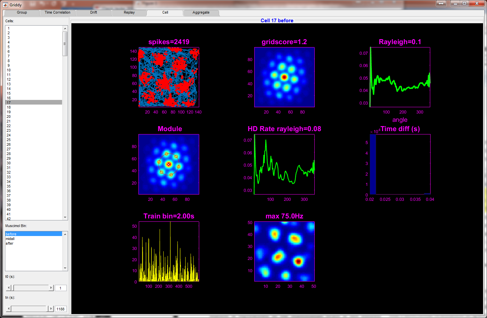

# Analysis of grid cell activity during hippocampal inactivation

This is the code used for the analysis presented in the paper "During hippocampal inactivation, grid cells maintain their synchrony, even when the grid pattern is lost." The data analyzed is from the study described in a previous paper, "Grid cells require excitatory drive from the hippocampus." Additionally there is code for viewing the data using a GUI (Pandora.m).

## Installation

This code was written and tested on MATLAB R2018.
Additional toolboxes maybe required depending on how code is used (in which case MATLAB will notify accordingly). The data necessary to generate the analysis is located on the Dryad database (a direct link will be updated at time of publication).

## Usage

The figures for the paper were generated using the functions f1.m for figure 1, f2.m for fig 2 etc. The supplementary figures have a different naming convention in the code but can be found using a global file search (i.e. search 'f3s1' to find fig 3s1). It is necessary to have the experiment data in order to generate this analysis (see Installation). Although the input data is provided in the above mentioned database, further post processing was done, which was used as input to generate the figures. All the code to pre- and post-process the data is in this repository, and can be found using a global file search for the variable or field name needed.  

## GUI

If you are interested in exploring this data, the Pandora.m GUI tool is a great starting point. To use the Pandora.m GUI, the GUI Layout toolbox must be present in MATLAB.

## Contact

For questions about the code contact Noam Almog noamza@gmail.com .

For questions about the data or the study, contact Dr. Dori Derdikman derdik@technion.ac.il

## License

For licencing and usage please contact Dr. Dori Derdikman derdik@technion.ac.il

https://derdiklab.technion.ac.il/